- [Table of Contents](#table-of-contents)
- [Lab Overview](#lab-overview)
- [Lab Environment Diagram](#lab-environment-diagram)
- [Lab Environment Setup ](#lab-environment-setup)
  - [Organizing and Renaming
    Containers](#organizing-and-renaming-containers)
    - [seed-attacker](#seed-attacker)
- [Summary of the DNS Configuration](#summary-of-the-dns-configuration)
- [Testing the DNS Setup](#testing-the-dns-setup)
- [Task 1: Directly Spoofing Response to
  User](#task-1-directly-spoofing-response-to-user)
- [Task 2: DNS Cache Poisoning Attack – Spoofing
  Answers](#task-2-dns-cache-poisoning-attack-spoofing-answers)
- [Task 3: Spoofing NS Records](#task-3-spoofing-ns-records)
- [Task 4: Spoofing NS Records for Another
  Domain](#task-4-spoofing-ns-records-for-another-domain)
- [Task 5: Spoofing Records in the Additional
  Section](#task-5-spoofing-records-in-the-additional-section)

# Table of Contents

[Lab Overview [3](#lab-overview)](#lab-overview)

[Lab Environment Diagram
[3](#lab-environment-diagram)](#lab-environment-diagram)

[Lab Environment Setup
[4](#lab-environment-setup)](#lab-environment-setup)

[Building containers [4](#_Toc182413499)](#_Toc182413499)

[Starting Containers [4](#_Toc182413500)](#_Toc182413500)

[Organizing and Renaming Containers
[5](#organizing-and-renaming-containers)](#organizing-and-renaming-containers)

[seed-attacker [6](#seed-attacker)](#seed-attacker)

[Summary of the DNS Configuration
[6](#summary-of-the-dns-configuration)](#summary-of-the-dns-configuration)

[Simplification [6](#_Toc182413504)](#_Toc182413504)

[Turning off DNSSEC [6](#_Toc182413505)](#_Toc182413505)

[DNS cache [7](#_Toc182413506)](#_Toc182413506)

[Testing the DNS Setup
[8](#testing-the-dns-setup)](#testing-the-dns-setup)

[Task 1: Directly Spoofing Response to User
[9](#task-1-directly-spoofing-response-to-user)](#task-1-directly-spoofing-response-to-user)

[Task 2: DNS Cache Poisoning Attack – Spoofing Answers
[10](#task-2-dns-cache-poisoning-attack-spoofing-answers)](#task-2-dns-cache-poisoning-attack-spoofing-answers)

[Task 3: Spoofing NS Records
[11](#task-3-spoofing-ns-records)](#task-3-spoofing-ns-records)

[Task 4: Spoofing NS Records for Another Domain
[14](#task-4-spoofing-ns-records-for-another-domain)](#task-4-spoofing-ns-records-for-another-domain)

[Task 5: Spoofing Records in the Additional Section
[15](#task-5-spoofing-records-in-the-additional-section)](#task-5-spoofing-records-in-the-additional-section)

[Figure 1: Building Lab Containers [4](#_Toc162481797)](#_Toc162481797)

[Figure 2:Starting Containers & Verify
[4](#_Toc162481798)](#_Toc162481798)

[Figure 3: Renaming Attacker Container
[5](#_Toc162481799)](#_Toc162481799)

[Figure 4: Source port number to 33333
[6](#_Toc162481800)](#_Toc162481800)

[Figure 5: DNS cache [7](#_Toc162481801)](#_Toc162481801)

[Figure 6: Result of dig ns.attacker32.com
[7](#_Toc162481802)](#_Toc162481802)

[Figure 7: Verifying resolution of example domain on both DNS Servers
[8](#_Toc162481803)](#_Toc162481803)

[Figure 8: Spoofing Response to User
[9](#_Toc162481804)](#_Toc162481804)

[Figure 9: Slowing traffic on router's eth0
[9](#_Toc162481805)](#_Toc162481805)

[Figure 10: Result of dig www.example.com
[10](#_Toc162481806)](#_Toc162481806)

[Figure 11: DNS Server's poisoned cache
[10](#_Toc162481807)](#_Toc162481807)

[Figure 12: zone_attacker32.com file
[11](#_Toc162481808)](#_Toc162481808)

[Figure 13: the edit to the spoofing script
[12](#_Toc162481809)](#_Toc162481809)

[Figure 14: DNS Server's poisoned Cache
[12](#_Toc162481810)](#_Toc162481810)

[Figure 15: Result of dig +short NS example.com
[13](#_Toc162481811)](#_Toc162481811)

[Figure 16: Edit to script to include google.com
[13](#_Toc162481812)](#_Toc162481812)

[Figure 17: Result of dig www.example.com
[14](#_Toc162481813)](#_Toc162481813)

[Figure 18: Local DNS server's cache
[14](#_Toc162481814)](#_Toc162481814)

[Figure 19: Edit to script to include ns.attacker32.com, ns.example.net
,www.facebook.com [15](#_Toc162481815)](#_Toc162481815)

[Figure 20: Local DNS server cache [15](#_Toc162481816)](#_Toc162481816)

# Lab Overview

The Domain Name System (DNS) functions as the Internet's directory,
converting hostnames into IP addresses and vice versa. DNS attacks
exploit this resolution process to redirect users to harmful sites. In
this lab, we will configure a DNS server and explore different DNS
attack techniques within a controlled environment to understand how
these attacks operate.

This lab concentrates on local DNS attacks and includes the following
topics:

- The functioning of DNS

- Configuring a DNS server

- DNS cache poisoning techniques

- Spoofing DNS responses

- Packet sniffing and spoofing methods

- Utilizing the Scapy tool

# Lab Environment Diagram

The primary target of DNS cache poisoning attacks is the local DNS
server. The lab environment requires four distinct machines: one for the
victim, one for the local DNS server, and two for the attackers. These
machines are all placed on the same LAN for this local attack scenario,
as shown in Figure 1:

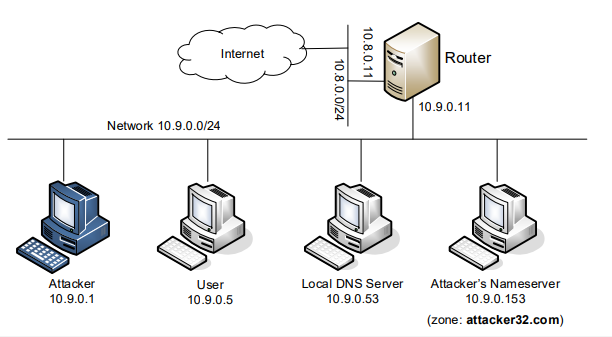

# Lab Environment Setup 

Building containers

<figure>
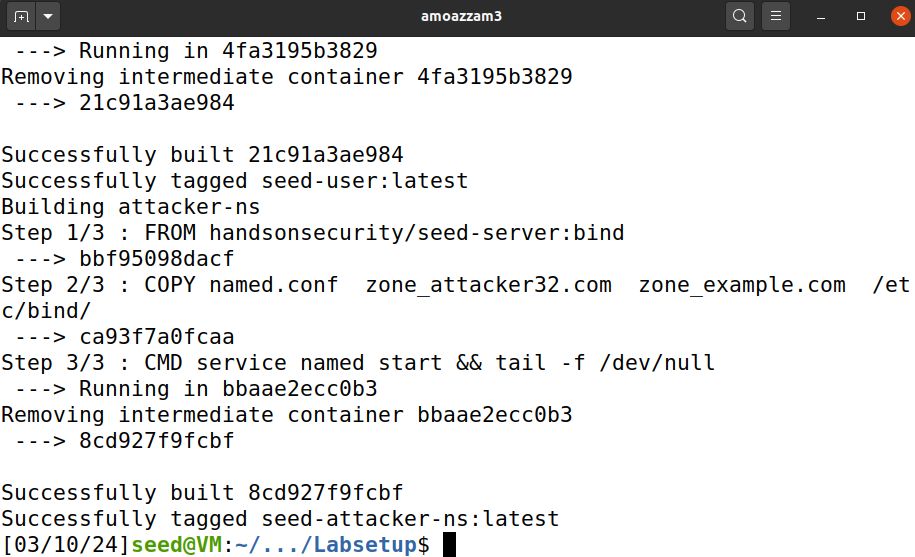
<figcaption>
Figure 1:
Building Lab Containers
</figcaption>
</figure>

Starting Containers

<figure>
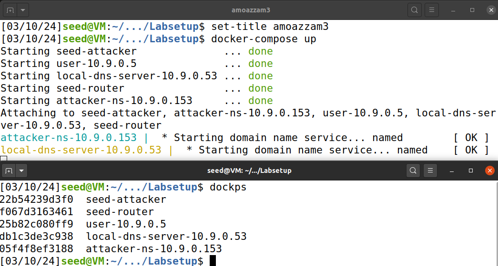
<figcaption>
Figure
2:Starting Containers &amp; Verify
</figcaption>
</figure>

## Organizing and Renaming Containers

Since the format and wording of the command prompt display of the
containers do not adequately identify them, we will need to improve
them.

I used:

export PS1='\\\033\[0;32m\\\D{%d.%m.%Y}
\\\033\[0;36m\\amoazzam3\\\033\[0;33m\\@\\\033\[0;35m\\seed-attacker-10.9.0.1
\\\033\[0;37m\\\w\n\\ \\\033\[0m\\'

Which means:

- \\\033\[0;32m\\: This part sets the color of the date to green.

- \D{%d.%m.%Y}: Inserts the current date in the specified format
  (day.month.year).

- \\\033\[0;36m\\: This part sets the color of the username to cyan.

- amoazzam3: Inserts my username.

- \\\033\[0;33m\\: This part sets the color of "@" symbol to yellow.

- @: Inserts the "@" symbol.

- \\\033\[0;35m\\: This part sets the color of the hostname to purple.

- seed-attacker-10.9.0.1: Inserts the container name with IP address.

- \\\033\[0;37m\\: This part sets the color of the directory to white.

- \w: Inserts the current working directory.

- \n: Inserts a new line.

- \\: : Inserts "\$" for a regular user or "#" for the root user,
  followed by a space.

- \\\033\[0m\\: Resets the color to the default.

### seed-attacker

<figure>
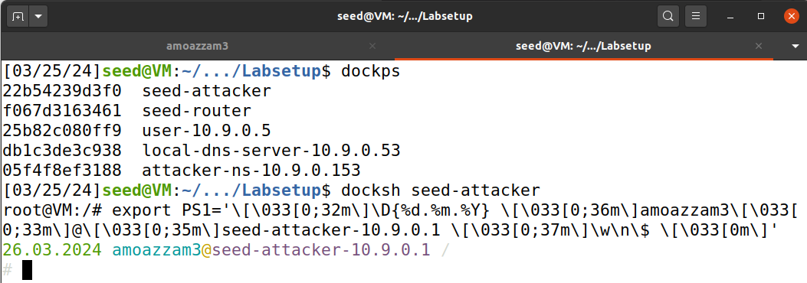
<figcaption>
Figure 3:
Renaming Attacker Container
</figcaption>
</figure>

I proceeded to this for the remaining 4 containers.

# Summary of the DNS Configuration

Simplification:

DNS servers now randomize the source port number in their DNS queries;
this makes the attacks much more difficult. Unfortunately, many DNS
servers still use predictable source port number. For the sake of
simplicity in this lab, we fix the source port number to 33333 in the
configuration file.

<figure>
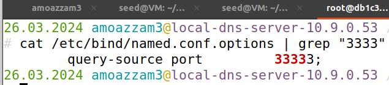
<figcaption>
Figure 4:
Source port number to 33333
</figcaption>
</figure>

Turning off DNSSEC:

DNSSEC is introduced to protect against spoofing attacks on DNS servers.
To show how attacks work without this protection mechanism, we have
turned off the protection in the configuration file.

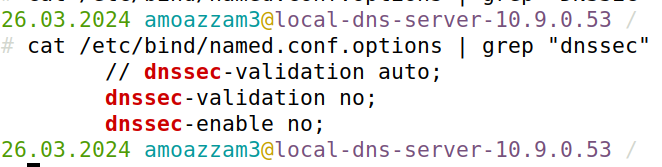

DNS cache:

During the attack, we need to inspect the DNS cache on the local DNS
server. The following two commands are related to DNS cache. The first
command dumps the content of the cache to the file
/var/cache/bind/dump.db, and the second command clears the cache.

<figure>
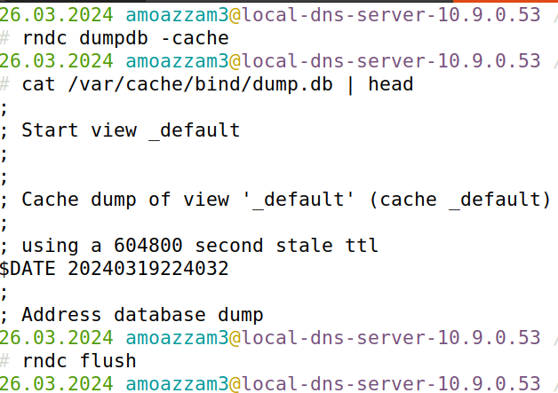
<figcaption>
Figure 5:
DNS cache
</figcaption>
</figure>

# Testing the DNS Setup

<figure>
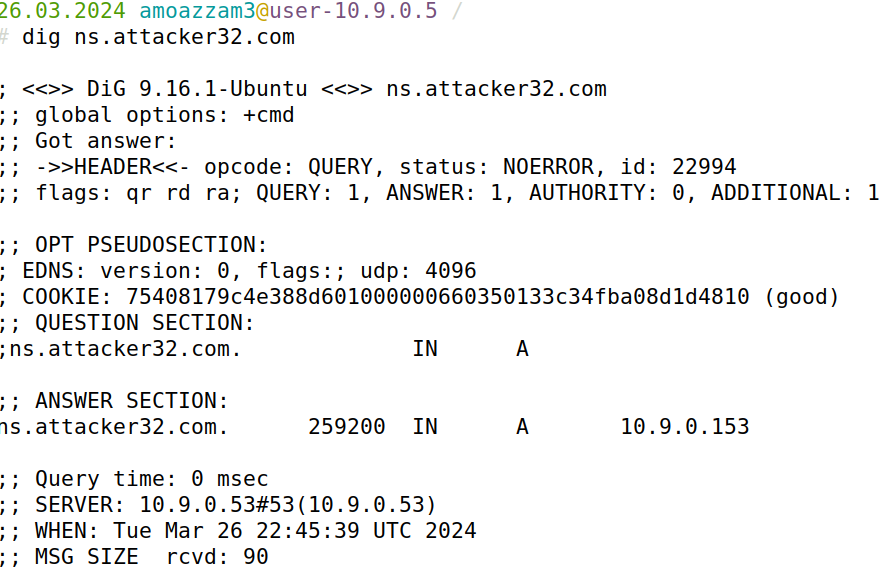
<figcaption>
Figure 6:
Result of dig ns.attacker32.com
</figcaption>
</figure>

We have confirmed that ns.attacker32.com resolves to the attacker’s
nameserver.

Get the IP address of www.example.com:

<figure>
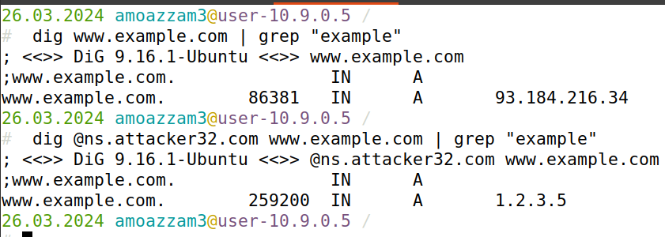
<figcaption>
Figure 7:
Verifying resolution of example domain on both DNS
Servers
</figcaption>
</figure>

We have confirmed that the 2 nameservers resolves to different IP
addresses for [www.example.com](http://www.example.com).

# Task 1: Directly Spoofing Response to User

In the provided dns_sniff_spoof.py script for spoofing we made the
following necessary changes to make the script work for our lab
environment:

Changed [www.example.net](http://www.example.net) to
[www.example.com](http://www.example.com) at line 5

Changed the IP address to 10.9.0.153 for answer section at line 15.

Renamed the iface name to the correct one for the attacker at line 40.

The edited script

After running the script on the attacker and using dig on the user, we
get:

<figure>
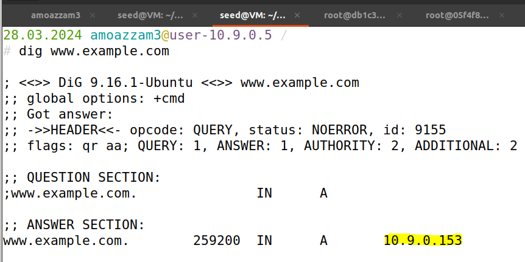
<figcaption>
Figure 8:
Spoofing Response to User
</figcaption>
</figure>

Which means we have successfully spoofed the response to the user.

# Task 2: DNS Cache Poisoning Attack – Spoofing Answers

We first need to slow down the traffic going to the outside for our DNS
query, so the authentic replies will not come that fast:

<figure>
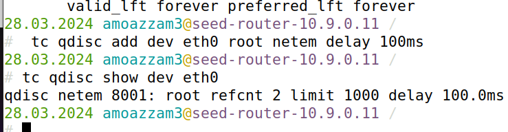
<figcaption>
Figure 9:
Slowing traffic on router's eth0
</figcaption>
</figure>

Then we edit line 39 of the script to f = 'udp and src host 10.9.0.53
and dst port 53' so the dns server will receive the reply. Then we dig
example.com again on the user:

<figure>
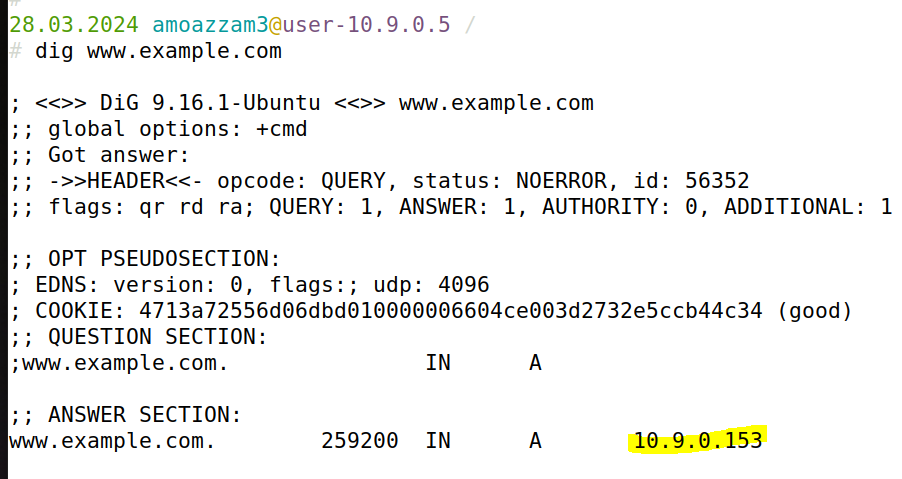
<figcaption>
Figure 10:
Result of dig <a
href="http://www.example.com">www.example.com</a>
</figcaption>
</figure>

Then we check the DNS’s cache to verify its been poisoned:

<figure>
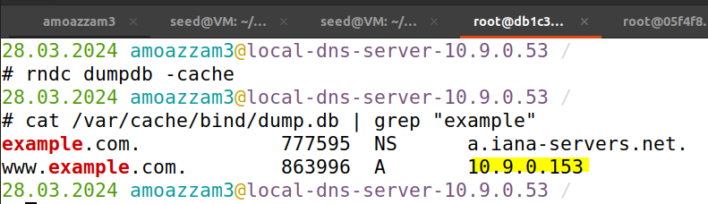
<figcaption>
Figure 11:
DNS Server's poisoned cache
</figcaption>
</figure>

# Task 3: Spoofing NS Records

From the attacker’s DNS server’s /etc/bind/zone_attacker32.com file we
see:

<figure>
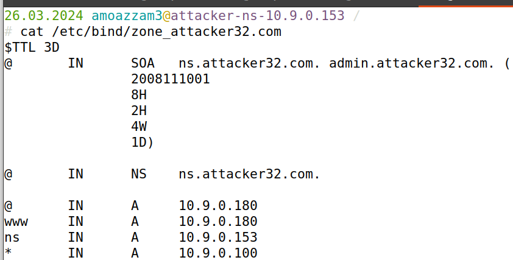
<figcaption>
Figure 12:
zone_attacker32.com file
</figcaption>
</figure>

Its fake name server is called ns.attacker32.com. To spoof a DNS reply
with that name server, we edit the authority section of the spoofing
script to resolve ns.attacker32.com:

<figure>
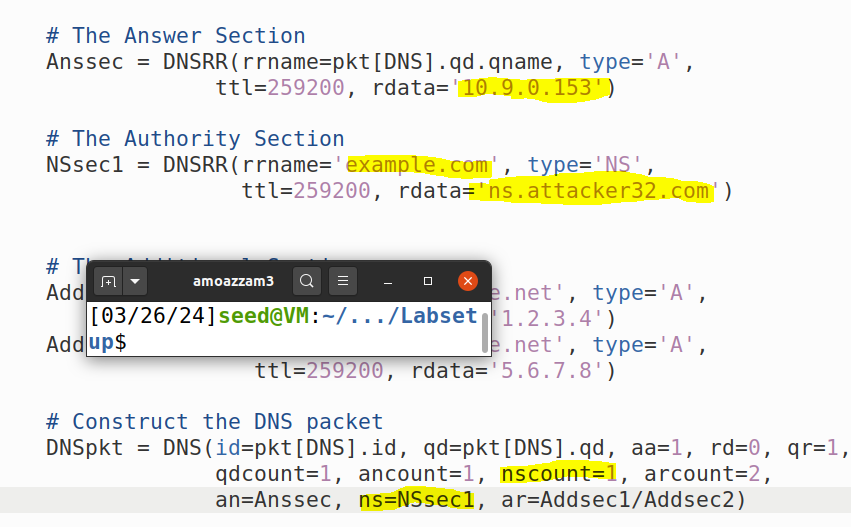
<figcaption>
Figure 13:
the edit to the spoofing script
</figcaption>
</figure>

After running the script and dig www.example.com we see that the DNS
server cache was successfully poisoned:

<figure>
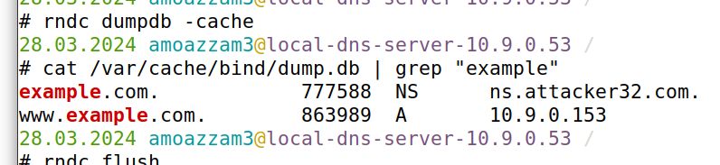
<figcaption>
Figure 14:
DNS Server's poisoned Cache
</figcaption>
</figure>

<figure>
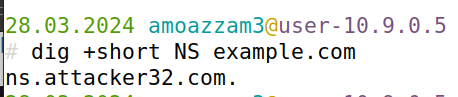
<figcaption>
Figure 15:
Result of dig +short NS example.com
</figcaption>
</figure>

# Task 4: Spoofing NS Records for Another Domain

We made the following changes to the spoofing script:

<figure>
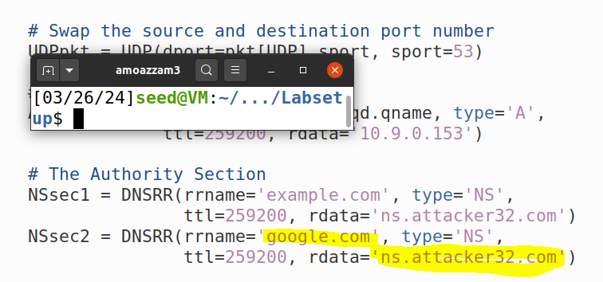
<figcaption>
Figure 16:
Edit to script to include google.com
</figcaption>
</figure>

Only spoofing the user directly will work as shown below:

<figure>
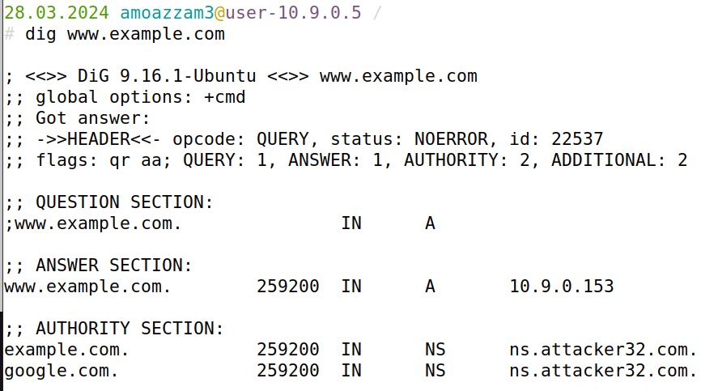
<figcaption>
Figure 17:
Result of dig <a
href="http://www.example.com">www.example.com</a>
</figcaption>
</figure>

However, it can’t be cached to the local DNS server, which only
includes:

<figure>
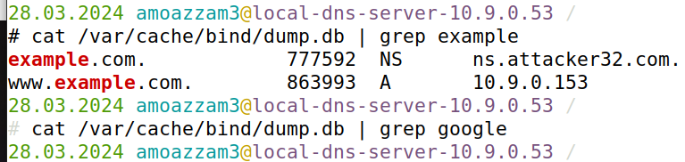
<figcaption>
Figure 18:
Local DNS server's cache
</figcaption>
</figure>

This attack didn’t work on the DNS server as it’s running Bind9 which
has security implementations that stops caching of answers that’s out of
zone of the question, meaning since google.com is not a subdomain of
[www.example.com](http://www.example.com) it will not be cached and
simply discarded. In order for the DNS server (running Bind9) to accept
an answer, the answer has to be a subdomain of the question.

# Task 5: Spoofing Records in the Additional Section

We made the following changes to the spoofing script:

<figure>
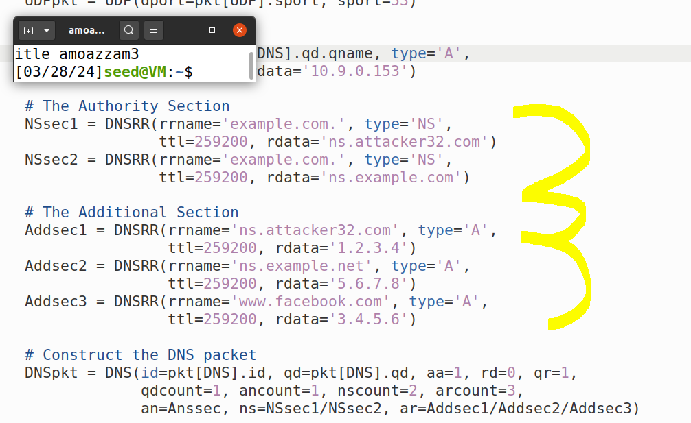
<figcaption>
Figure 19:
Edit to script to include ns.attacker32.com, ns.example.net
,www.facebook.com
</figcaption>
</figure>

After we ran the script,

<figure>
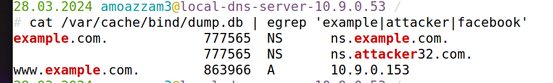
<figcaption>
Figure 20:
Local DNS server cache
</figcaption>
</figure>

As a reminder, below shows the contents of the DNS response packet:

;; AUTHORITY SECTION:

example.com. 259200 IN NS ns.attacker32.com.

example.com. 259200 IN NS ns.example.com.

;; ADDITIONAL SECTION:

ns.attacker32.com. 259200 IN A 1.2.3.4

ns.example.net. 259200 IN A 5.6.7.8

www.facebook.com. 259200 IN A 3.4.5.6

Only ns.attacker32.com and ns.example.net were cached because
ns.example.com is within zone and a subdomain of example.com.
ns.attacker32.com isn’t a subdomain of example.com however it’s a NS
record and name servers can be out of zone and this is commonly the case
in the real world and also that record’s rrname (Resource Record Name)
is example.com which is within the zone of the question
[www.example](http://www.example) which is also a requirement for it to
be accepted. All of the additional records were discarded since they
were all out of zone of www.example.com.
